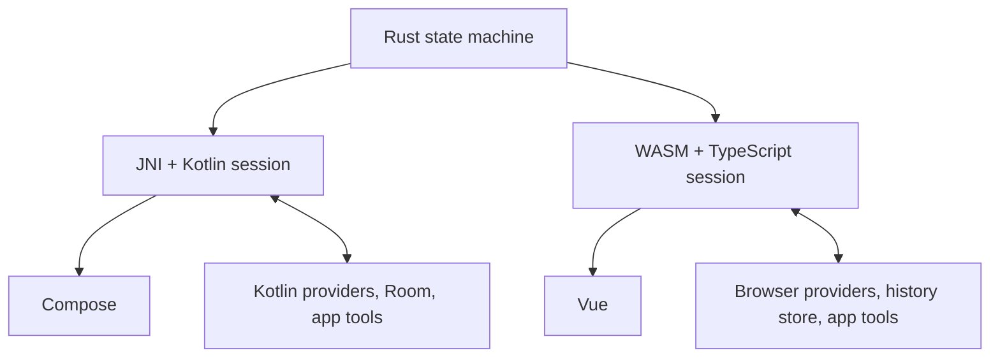

# Shared engine architecture

## Protocol

The bridges expose create, dispatch, snapshot and disposal through their native
language conventions. Dispatch exchanges version-1 JSON envelopes. Rust owns the
serialized contract; TypeScript and Kotlin expose typed application APIs.
`fixtures/conformance.json` runs through Rust, real WASM and real JNI.

Commands cover send, cancel, clear, switch-mode, language selection, restart,
restart confirmation/dismissal, provider events and tool results. Outputs contain
state, ordered effects and a persistence flag. Effects request provider streaming,
app tool execution or cancellation. The provider adapter must emit an explicit
successful `done`; an interrupted stream never authorizes pending tools.

Every session and request has an identity. Only the currently pending request can
complete. Hosts abort canceled effects and recheck cancellation before dispatching
app actions. Kotlin serializes command and storage operations under a mutex;
TypeScript serializes durable writes before executing new effects. Storage failure
stops external work rather than allowing the displayed and durable transcripts to
diverge. Close/free is explicit; callers must dispose sessions they own.

Provider credentials never enter the engine. Hosts may refresh authentication;
Android retries once only before any response data has been emitted. Tool
confirmation lives in the host, tied to the pending call and arguments.

## Mode definitions

A mode stores ID, name, description, own prompt, explicit tools, child nodes,
ancestor-prompt selection and a revision. Ancestor references are validated and
ordered by tree ancestry. No implicit recursive prompt inheritance occurs when
selecting one ancestor: selecting a parent selects that parent's own prompt only.

History stores mode-change positions and snapshots referenced by user messages.
Snapshots include effective prompt, ancestor selection, tool specifications and
revision. Their canonical serialized content is SHA-256 fingerprinted. Changes
require explicit mode selection on restart. The current implementation compares
snapshots, including their display name, so renaming a mode also requests selection.

The `switch_mode` built-in supports list, current and switch. Tree organization
and prompt rules do not constitute application authorization. App tools are
validated against the mode active at execution, including calls after a mode
switch in the same batch.

## Transcript and context

Archive message order is authoritative; timestamps are presentation metadata.
Summaries cover an exclusive prefix index ending at a user-turn boundary. They
never replace transcript records. Context retains whole recent turns and their
tool/result pairs. Summary work holds its own pending request and is invalidated
by cancellation, clear, language changes or mode switching.

Restart finds an existing user-message ID and checks its mode snapshot before
truncating anything. Changed/unknown modes produce a pending choice tied to the
current archive revision. Once resolved, restart truncates the continuation,
restores/records the chosen mode, discards the old summary and rebuilds from the
retained prefix. No stored summary containing future content can enter that retry.

## Migration boundaries

Android Room v2 adds `assistant_archive`; the old message table is imported in
`timestamp, rowid` order. After a successful transactional archive save the old
rows are removed, leaving one authoritative copy. Available history is preserved;
already-discarded old summaries/messages cannot be reconstructed. Imported turns
have unknown original modes and follow the normal mode-choice path.

Pezzottify keeps authentication, UI/MCP tool implementations, business prompts,
confirmation rules and friendly tool descriptions. Its web package dependencies
point at sibling built packages during development; Vite deduplicates Vue and
Node tests preserve symlink resolution to use the host's Vue instance.
